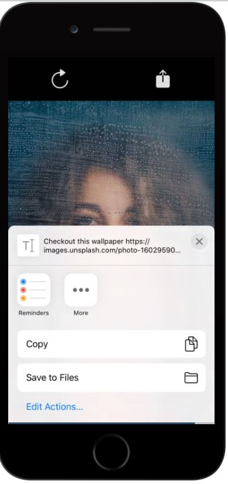

# Photo-Gallery-App

## Code and Live demo 

[snack code](https://snack.expo.io/@roukiasalahi/0dcba1)

## About the App

If you are a photographer and you love to see different quality images and ideas from time to time this application is the right one for you!

Instead of opening google and just see random images that takes much time to look for and might not be as your expectation as a photographer, don't worry anymore you can now easily open this application and have easy access to a huge collection of photos that you can view and get inspiration from for your future photo sessions also you can share anything easily with your clients and give them some ideas how to pose in pictures or you can just share anything you like with your friends that have the same taste and passion.

## How do I use this application ?

- Open the app
- Swip right and left between images to see a collection of photes.
- Press the share icone to share the link of the image with your friends
- Press the reffresh icon to get a new collection!

